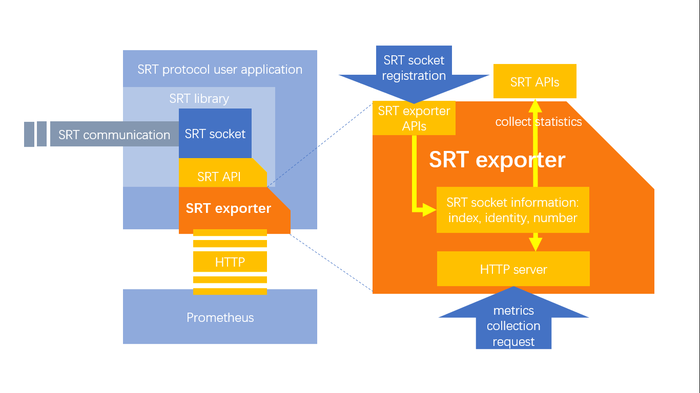
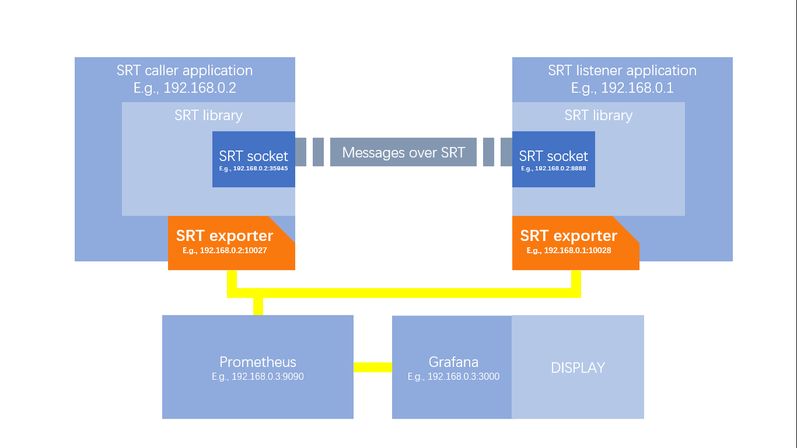

# Prometheus SRT Exporter

## Description

  SRT Exporter is a Prometheus exporter for Secure Reliable Transport protocol.

  

  SRT Exporter library is based on [SRT Stats APIs](https://github.com/Haivision/srt/blob/master/docs/API/statistics.md) and [Prometheus Instrumenting Client Library](https://prometheus.io/docs/instrumenting/clientlibs/).  
  It allows us to get the statistics for each SRT socket and send those data to Prometheus as metrics on request.  

## Supported Versions

  [SRT](https://github.com/Haivision/srt/): v1.4.0  
  Ubuntu: 20.04  

## Building and Using

  Please check details in [building, installing, and integration tutorial](./document/tutorial.md).

## API

  Please check details in [api description](./document/api.md).

## Development

  Please check details in [design document and todo list](./document/design.md).

## License

  .

## Samples

  

