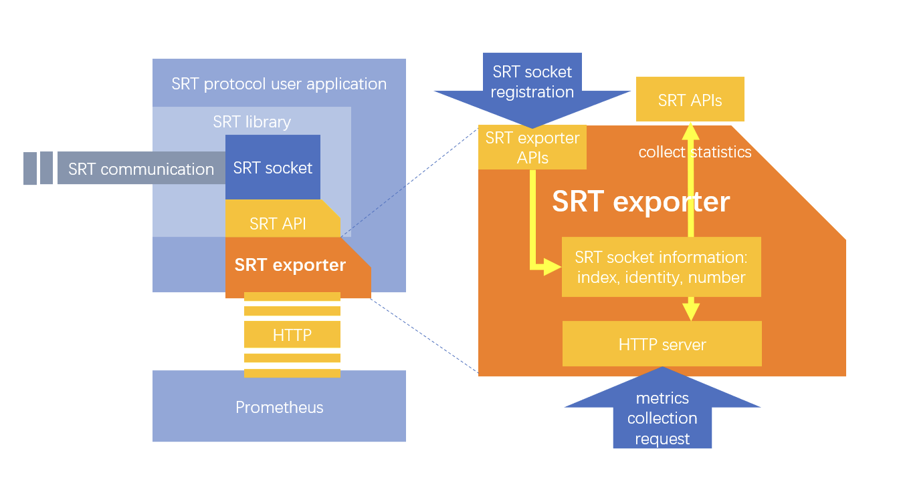
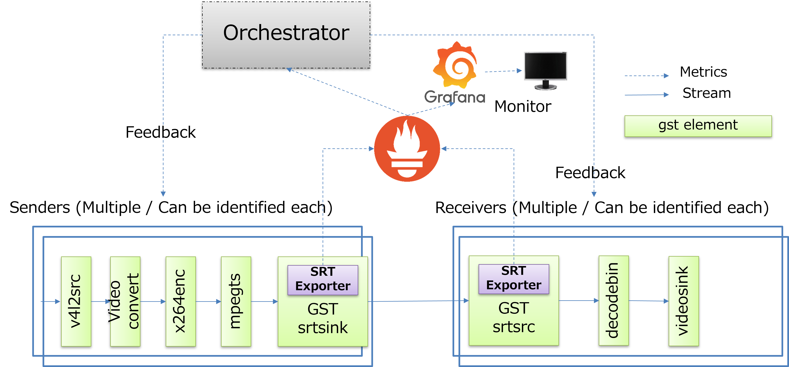

# SRT Prometheus Exporter

## Overview

SRT Prometheus Exporter is an implementation of [Prometheus](https://github.com/prometheus/prometheus) Exporter for [Secure Reliable Transport (SRT)](https://github.com/Haivision/srt) protocol.

SRT Prometheus Exporter is a library built on top of [SRT Stats APIs](https://github.com/Haivision/srt/blob/master/docs/API/statistics.md) and [Prometheus Instrumenting Client Library](https://prometheus.io/docs/instrumenting/clientlibs/).
It allows user application to get the statistics for each SRT socket and send those data to Prometheus as metrics on request.
SRT Prometheus Exporter integrates HTTP server in it so that statistics can be scraped by the request from Prometheus.

See [SRT Prometheus Exporter Introduction](./document/introduction_slides.pdf)

## Motivation

To maintain and support good user experience with streaming application, it is really important to comprehend the statistics and metrics for entire system to feedback and adjust the settings for the application.
Statistics, metrics and tracing data is necessary and important for cloud infrastructure to keep the system running and maintained.
Once it comes to edge IoT devices, these data will be more critical to provide the good user experience, and required to maintain the whole services and systems for orchestration.
Even more, considering more sophisticated application as circulatory functioning system, it will be required to manage the parameter and deployment based on these statistics at runtime.

[Prometheus](https://github.com/prometheus/prometheus) is agnostic from statistics details, that means that can provide common interface to access the statistics for user application.
This makes it easier to access and take advantage of statistics in many use cases in platform agnostic way.

***Note: This repository is dedicated to SRT Prometheus Exporter library, so does not include gstreamer property extension.***

### Documentation

- [Installation](./document/installation.md)
- [Tutorials](./document/tutorial.md)
- [Design](./document/design.md)
- [Proposals](./document/proposals.md)

### [Contribution](./CONTRIBUTING.md)

We can accept incoming issues and PRs, but rules are still under consideration.

## License

Mozilla Public License Version 2.0, [LICENSE](./LICENSE)
