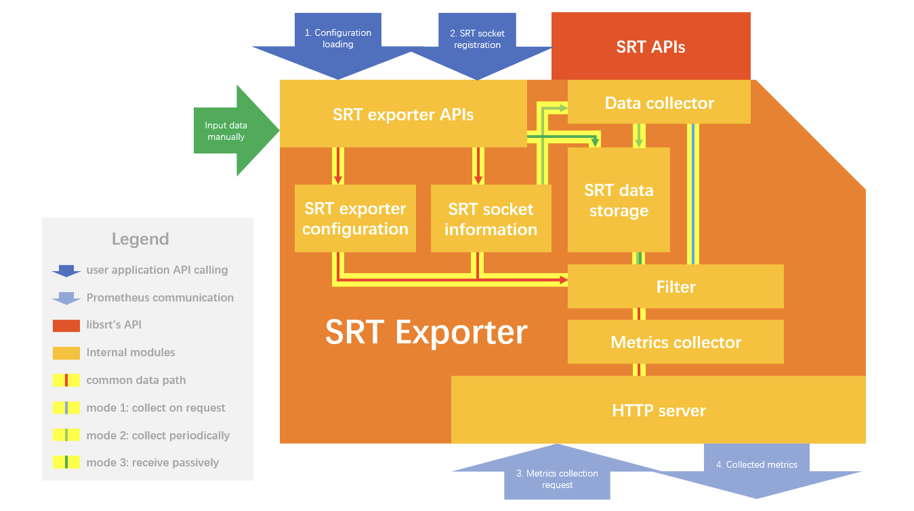
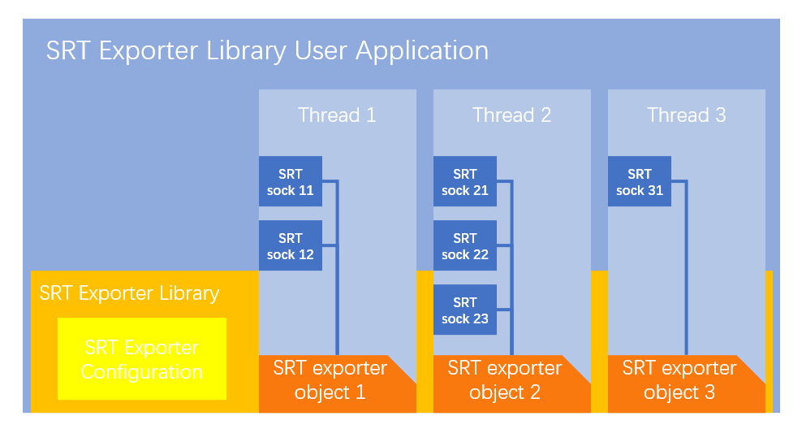

# Design

## Overview

As you can see below overview, SRT Prometheus Exporter is library that can bind SRT statistics APIs and Prometheus HTTP server. SRT Prometheus Exporter collects statistics on each socket, then expose those statistics to the Prometheus server via http protocol.



## Features

### Multiple Socket Support

It is not likely but possible that streaming device can have multiple cameras on it.
In that case, there would be multiple SRT socket created on camera devices to send the streaming data simultaneously.
To support this use case, SRT Prometheus Exporter can manage multiple exporter objects internally even with single process space.
Each exporter object belongs to dedicated http server, since the implementation of Prometheus c++ client library, but can register multiple SRT sockets with it.
Each SRT Exporter object has a separate lifecycle.



### Collection Mode

Currently there is only one mode available, which is to collect data on request.
Prometheus server requests the SRT Prometheus Exporter via http to collect the statistics, and the SRT Prometheus Exporter issue SRT statistics API to response the data.
This is most simple request-response method to support most use cases.

### Statistics Filtering

Sending all statistics based on `CBytePerfMon` defined in `srt.h` would be overkill for some use cases since which is the full set of all statistics.
It is likely that user application requires or interested in specific statistics to filter in or out before sending the data via http.
The `Statistics Filtering` can be configured through configuration files in the ways to `whitelist` and `blacklist` mode to allow the user to filter the specific statistics.
Each SRT Exporter object can have a different filter, but SRT sockets registered to the same SRT Exporter object share the same filter.

## Configuration

SRT Prometheus Exporter can be configured with the following configuration file by user.
User needs to adjust the configuration aligns with requirements and application.

Default configuration is installed to `/etc/srtexp/srt_exporter.yaml`.
User can specify a customer configuration file location in `srtexp_init` when initializing SRT Exporter.

### Example Configuration

```yaml
global:
    ip: 127.0.0.1
    port_min: 9901
    port_max: 10028
    collector_mode: collect_on_request
    filter:
    filter_mode: common
    labels:
    - name: source
        value: srt_exporter

srt_exporters:
    - name: sample_srt_caller
    ip: 127.0.0.1
    port: 10027
    collector_mode: collect_on_request
    filter:
        filter_mode: whitelist
        whitelist: ['pktSentTotal', 'pktRecvTotal', 'pktSndLossTotal', 'pktRcvLossTotal', 'pktSent', 'pktRecv', 'pktSndLoss', 'pktRcvLoss', 'pktRetrans', 'pktRcvRetrans', 'pktSentACK', 'pktRecvACK', 'pktSentNAK', 'pktRecvNAK', 'byteSent', 'byteRecv', 'usSndDuration', 'msSndTsbPdDelay', 'mbpsBandwidth', 'msRTT']
    labels:
        - name: sample_name_1
        value: sample_value_1
    - name: sample_srt_listener
    ip: 127.0.0.1
    port: 10028
    filter:
        filter_mode: srt_destination
    labels:
        - name: sample_name_2
        value: sample_value_2
```

### Parameters

- Global and Object Specified

  Each SRT Exporter object can use customized configuration, otherwise, it uses the global one.
  A `name` is required in each `srt_exporters` element to pair the configuration and the object. It is specified in the API to start the particular SRT Exporter object.

- Server Address

  A local address and port is required to start the http server. If they are not specified, an available port within a range would be chosen for the new SRT Exporter object.
  Illegal address or unavailable port will result in a failure of starting the SRT Exporter.

- Collector

  Currently, only one collector mode is supported, any value would result in the same.

- Filter

  Filter is for picking a subset of `struct CBytePerfMon` to put into metrics and send to Prometheus.
  `filter_mode` takes the following values:
  - `whitelist`: input a list of variables to be included in the metrics, `whitelist` should be specified.
  - `blacklist`: input a list of variables to be excluded in the metrics, `blacklist` should be specified.
  - `srt_source`: use a list of variables usually cared by the SRT source. No variable list need to be specified.
  - `srt_destination`: use a list of variables usually cared by the SRT destination.
  - `srt_common`: use a list of variables usually cared by the SRT source or destination. No variable list need to be specified.

- Labels

  Some labels to present in the metrics for managing the data better.

| Name | Scope | Usage | Sub-item | Legal Values | Remark |
|:---|:---|:---|:---|:---|:---|
| ip | global/srt_exporters | a local address to start http server for metrics collecting || string of IP address in decimal digits ||
| port_min | global | minimal local port to start http server for metrics collecting || legal port number ||
| port_max | global | maximal local port to start http server for metrics collecting || legal port number | no less than port_min |
| name | srt_exporters | the identity of an SRT Exporter object || string | don't use the same name for different objects |
| port | srt_exporters | a local port to start http server for metrics collecting || legal port number | don't have to be within [port_min, port_max] |
| collector_mode | global/srt_exporters | metrics collecting and caching strategy || "collect_on_request" | only one mode is supported for now |
| filter | global/srt_exporters | define a set of variables to export | filter_mode | "whitelist", "blacklist", "srt_source", "srt_destination", "srt_common" ||
|||| whitelist | a list of variable name strings | required only when filter mode is "whitelist" |
|||| blacklist | a list of variable name strings | required only when filter mode is "blacklist" |
| labels | global/srt_exporters | a list of name-value pairs to be added to all metrics | name | string ||
|||| value | string ||

## API

### SrtExpRet srtexp_init(const char *configFile)

- This API should be called when SRT Exporter library user application starts.
- It loads configuration of the library from a specified path, or from the default location when the input is a NULL pointer.

### SrtExpRet srtexp_deinit()

- Clear all SRT Exporter objects and release memory of loaded configuration.

### SrtExpRet srtexp_start(const char *exporterName, int *id)

- This API starts an SRT Exporter object with or without a specified name.
It also provides a numeric `id` for the user to identify this object later.
- `exporterName` helps the library to find the specified configuration for this new SRT Exporter object.
It is OK to put a NULL pointer for `exporterName` to start an SRT Exporter object using global configuration.
- You can have multiple SRT Exporter object in one process.
Each of them has a separate http server on a different port.

### SrtExpRet srtexp_stop(int id)

- Use this API to stop an SRT Exporter object with the `id` provided by `srtexp_start`.

### SrtExpRet srtexp_stop(const char *exporterName)

- Use this API to stop an SRT Exporter object with the specified name.

### SrtExpRet srtexp_label_register(const char *name, const char *value, int id)

- This API provide an interface for use to add, edit, or remove a label of the SRT Exporter object dynamically.

### SrtExpRet srtexp_srt_socket_register(SRTSOCKET *sock, int sockNum, int id)

- This API register the SRT sockets to track to one SRT Exporter object with the `id` provided by `srtexp_start`.
- You can overwrite the SRT sockets registered before by call this API again.

### SrtExpRet srtexp_set_log_dest(SrtExpLogDestination dest)

- Use this API to change the logging destination of SRT Exporter library.
- `SRT_EXP_STDERR = 0` for standard error, `SRT_EXP_SYSLOG = 1` for syslog.
- Syslog is the default logging destination.

### SrtExpRet srtexp_set_syslog_level(int level)

- Use this API to change the logging level of SRT Exporter library.
- Log level `LOG_ERR`, `LOG_NOTICE`, and `LOG_DEBUG` defined by syslog are expected input.
