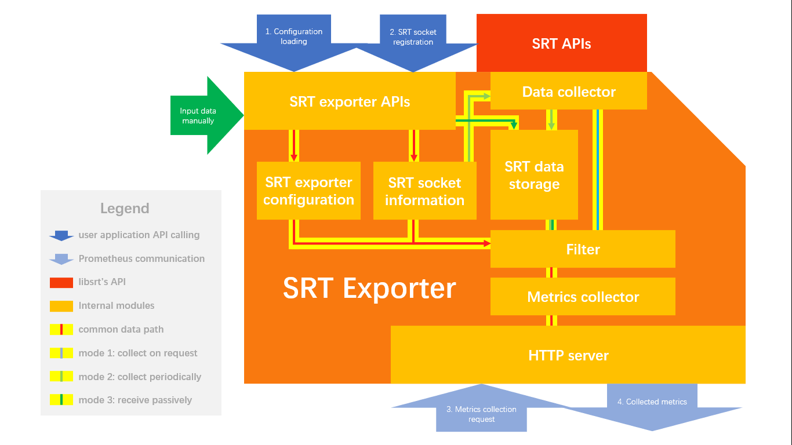

# Design Document of SRT Exporter Library for Developers

## Big Picture

## Main Features

### Multiple SRT Exporter Objects

  

  Because of the implementation of Prometheus c++ client library, each http server created for collecting metrics may only have one collector function registered.
  But it is possible to collect data of multiple SRT sockets in one collector function.

  We can have multiple SRT Exporter objects at the same time in one process. Each SRT Exporter object is bound to one http server. And single or multiple SRT sockets may be registered to the http server. Each SRT Exporter object has a separate lifecycle.

### Collector Modes

  - Mode 1: collect data on request (default mode, and the only supported mode, yet).  
      Metrics request from Prometheus triggers collector to get statistics with libsrt's API.  
      This is the easiest to implement, and can handle most scenarios.  

  The other modes would be implemented in the future.

### Filter of the Statistics

  `struct CBytePerfMon` defined in `srt.h` is the full set of all statistics. There are almost a hundred items in it. Actually, in most cases, we care only a few items within it. Thus we need a filter to pick out a subset to focus our attention.

  The filter can be customized through configuration file. Some filter modes use pre-set fixed filter. `whitelist` and `blacklist` mode let user input customized variable list to define the filter.
  
  Each SRT Exporter object can have a different filter, but SRT sockets registered to the same SRT Exporter object share the same filter.

## To Do List

### Support Two More Collector Modes

  - Mode 2: collect and store data periodically.
      After SRT socket is registered to SRT Exporter, data collector keeps collecting the data periodically. And when request from Prometheus is received, all cached data are sent to Prometheus.
      A data storage or cache is introduced for this mode. This mode can reduce the packet number between Prometheus and SRT Exporter.
  - Mode 3: receive and store data passively.
      User can use API to store data into SRT Exporter manually.
      You can write and store customized things for Prometheus to collect.

