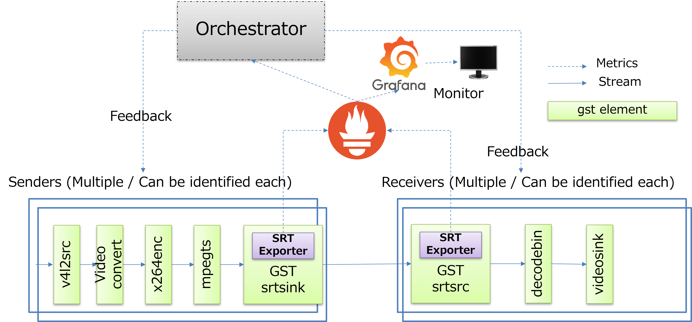

# SRT Prometheus Exporter

---

# Agenda

- Who we are?
- OSS Activity
- SRT Features
- Motivation
- Overview
- Discussion

---

# Who are we?

- Yinzhe Wu
  - Sony China
  - Software Engineer
  - [Windrow14@Github](https://github.com/Windrow14)
- Tomoya Fujita
  - Sony R&D Center, US Lab
  - Senior Staff Engineer
  - [fujitatomoya@Github](https://github.com/fujitatomoya)
  - [Robot Operating System Technical Steering Committee](https://docs.ros.org/en/rolling/The-ROS2-Project/Governance.html#technical-steering-committee-tsc)

---

# OSS Activities

We have been working with OSS communities for a while,

- [Robot Operating System](https://www.ros.org/)
  - [Robot Operating System Technical Steering Committee](https://docs.ros.org/en/rolling/The-ROS2-Project/Governance.html#technical-steering-committee-tsc)
  - [ROSCon 2018 Keynote Home Entertainment Robot](https://vimeo.com/293292255)
  - [ROSCon 2019 Panel Talk Edge at Scale](https://vimeo.com/378682623)
  - [ROS World 2021 Content Filtering Feature](https://vimeo.com/649654533/c8104829db)
  - [ROSCon 2022 Keynote & Programing Committee](https://roscon.ros.org/2022/)
- [Kubernetes](https://kubernetes.io/)
  - [KubeCon EU 2021 Edge Day Robotics Edge Cluster System](https://kubenetesedgedayeu21.sched.com/event/iS23/kubernetes-robotics-edge-cluster-system-tomoya-fujita-sony-corporation-feng-gao-sony-china-limited)
  - [Kubernetes Robotics Distributed System](https://www.slideshare.net/FujitaTomoya/kerbernetes-robotics-distributed-system-deep-dive)

---

# SRT Differentiating Features

- Reliability
- Latency Window
- Timestamp Based Packet Delivery
- Too-Late Packet Drop
- Fast Retransmit
- Bidirectional Transmission Queues
- ***Statistics (HERE !!!)***
- Access Control (Stream ID)

---

# Motivation

- Statistics / Metrics / Tracing data is being necessary and important for cloud infrastructure to keep the system maintained.

- Once it comes to edge, these data will be required to maintain the whole services and systems for orchestration.

- Dynamic application re-deployment / parameter re-adjustment will be required to keep the service. (Circulatory Functioning System and Application.)

---

---

---

---

- SRT Prometheus Exporter
  - Single Shared Library
  - Depends: https://github.com/Haivision/srt (statistics APIs)
  - Description: calling SRT Statistics APIs internally based on SRT socket, it will expose the statistics via http. Prometheus server can scrape the statistics and deal with monitor and alerting.

- Gstreamer SRT src/sink property
  - Patch has been developed
  - Depends: https://github.com/GStreamer/gst-plugins-bad/tree/master/ext/srt 
  - Description: adding extra property for exporter enable/disable flag, port range, socket identification.

---

# What we want to discuss?

- Anyone interested?
- Can we maintain this library as SRT community?
- More use cases, feature requests and feedback.
- Anything else?

we are open to discuss on any possibility !!! Thanks!
