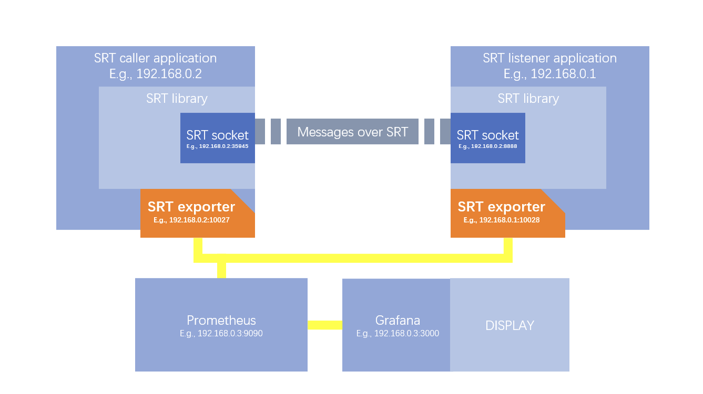

# Tutorials

## Prometheus Server

To start the sample application, it does require Prometheus server running to collect the statistics from SRT Prometheus Exporter.
There are several ways to install and run Prometheus server, it is up to user to set this up.

- Run Docker image

  ```bash
  docker pull prom/prometheus
  ```

- Install [Debian package](https://packages.debian.org/search?keywords=prometheus)


- Snap pacakge

  ```bash
  sudo snap install prometheus
  ```

  Default configuration file would be found at `/var/snap/prometheus/53/prometheus.yml`.
  please, edit the configuration file, so that Prometheus can find the correct url to scrape.

## Sample



### Build

`sample_app_srt_caller_c` and `sample_app_srt_listener_c` can be compiled.

```bash
cd srt-prometheus-exporter/sample
make
```

## Run Endpoints

```bash
./sample_app_srt_caller_c
```

A sample of SRT caller application.

It creates SRT socket and updates SRT socket information to SRT Exporter library.
Its SRT Exporter object's name is `sample_srt_caller`.
It tries to connect port `8888` with this SRT socket. Once connection is accepted, this application keeps sending packages to the listener each second.

Access `http://127.0.0.1:10027/metrics` from a browser to trigger an http request to it manually.


```bash
./sample_app_srt_listener_c
```

A sample of SRT listener application.

It starts listening to port on `8888` when application started. Once an SRT caller wants to connect this port, it accepts the connection and starts receiving packages from this connection.
The SRT socket of this connection would be updated to SRT exporter once the connection is established. Thus, SRT socket statistic requested from Prometheus can be collected from SRT library.
Its SRT Exporter object's name is `sample_srt_listener`.

Access `http://127.0.0.1:10028/metrics` from a browser to trigger an http request to it manually.


## Run Prometheus

For example, using Prometheus from a docker image.

```bash
docker run -d \
-v $(PROMETHEUS_CONFIG_DIR):/etc/prometheus/ \
--network=host prom/prometheus \
--web.enable-lifecycle \
--config.file=/etc/prometheus/prometheus.yml \
--storage.tsdb.path=/prometheus \
--web.console.libraries=/usr/share/prometheus/console_libraries \
--web.console.templates=/usr/share/prometheus/consoles
```

You should be able to see, Prometheus dashboard


and, statistics.


