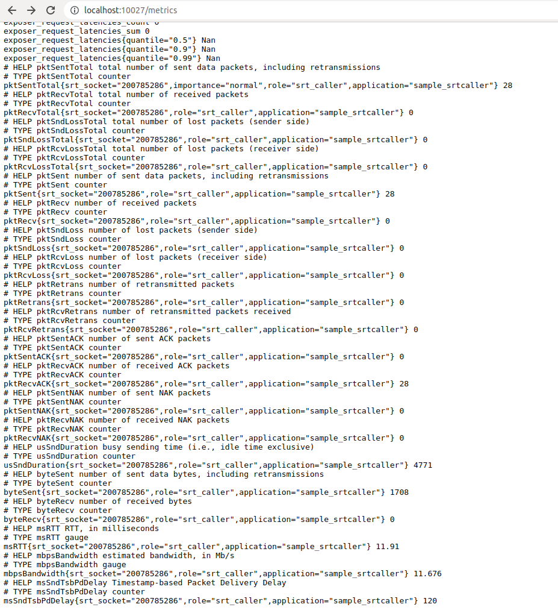
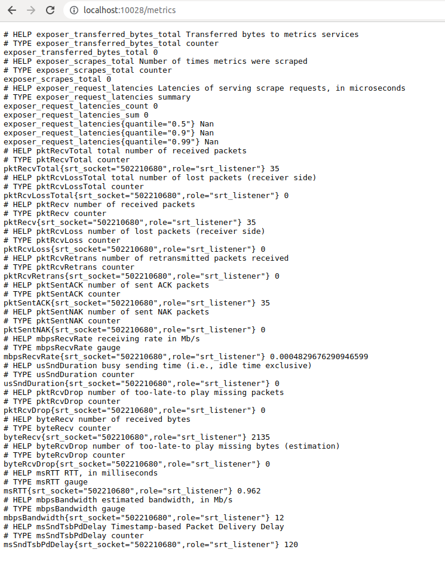
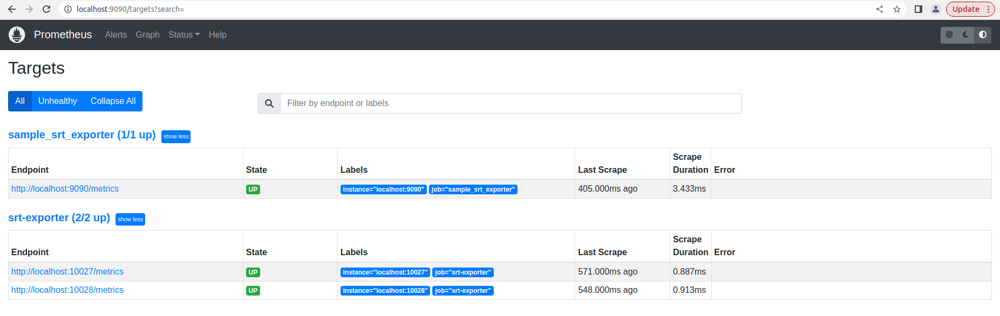
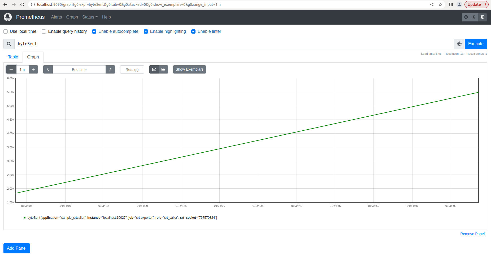

# Tutorial

## Conditions

### System Requirement

    Ubuntu 20.04 only, for the time being.

### Compiler

    C++11 compliant compiler.
    ```
    sudo apt-get install g++
    ```

### Dependencies

1. Prometheus cpp client library

    As an exporter for Prometheus in c++, SRT Exporter library depends on client library in c++ to establish http server for Prometheus to grab data from.

    Install client library first.

    Clone the following source code:  
    > https://github.com/Haivision/srt-prometheus-exporter.git

    Then build and install the library.

    Install `curl`, `cmake`, `pkg-config` first, because the compilation of this library depends on them.

    ```
    sudo apt-get install libcurl4-openssl-dev build-essential cmake zlib1g-dev pkg-config -y
    mkdir ~/Works
    cd ~/Works
    git clone https://github.com/Haivision/srt-prometheus-exporter.git
    cd srt-prometheus-exporter
    git submodule init
    git submodule update
    mkdir _build
    cd _build
    cmake .. -DBUILD_SHARED_LIBS=ON
    make -j 4
    sudo make install
    ```

    Verify the result of the installation.
    ```
    ls /usr/local/lib/libprometheus-cpp*
    ```

    ```
    /usr/local/lib/libprometheus-cpp-core.so         /usr/local/lib/libprometheus-cpp-pull.so.0.12.3
    /usr/local/lib/libprometheus-cpp-core.so.0.12    /usr/local/lib/libprometheus-cpp-push.so
    /usr/local/lib/libprometheus-cpp-core.so.0.12.3  /usr/local/lib/libprometheus-cpp-push.so.0.12
    /usr/local/lib/libprometheus-cpp-pull.so         /usr/local/lib/libprometheus-cpp-push.so.0.12.3
    /usr/local/lib/libprometheus-cpp-pull.so.0.12
    ```

2. SRT library

    SRT Exporter needs SRT socket information, so that it can use SRT library's interface to get statistics of the socket directly.

    The stable version can be installed with `sudo apt-get install libsrt-dev` on an `Ubuntu 20.04` version is `v1.4.0`.  
    **If SRT library is compiled from code, be sure that the code is reset to `v1.4.0`. Otherwise, srt_exporter library compiled would not work with installed SRT library on other devices. Make sure that SRT Exporter library is built and running based on the same version of SRT library.**  
    ```
    commit 32070d05d11413513ecac5b61314fc5570936449 (HEAD -> master, tag: v1.4.0)
    Author: Roman <romandi@gmail.com>
    Date:   Fri Sep 13 14:41:42 2019 -0400

        Bump version to 1.4.0
    ```

3. Yaml-cpp library

    SRT Exporter use yaml format configuration file, so `yaml-cpp` library should be installed.
    ```
    sudo apt-get install libyaml-cpp-dev -y
    ```

4. Prometheus

    There are different ways to install Prometheus.

    - Download from official site
    `https://prometheus.io/download/`  
    `https://github.com/prometheus/prometheus/releases/download/v2.28.1/prometheus-2.28.1.linux-amd64.tar.gz`  

    - Download and Run Docker image
    `docker pull prom/prometheus`

    - Debian
    `https://packages.debian.org/search?keywords=prometheus`

    - Snap
    `sudo snap install prometheus`  
    Default configuration file would be found at `/var/snap/prometheus/53/prometheus.yml`  

    Do remember to edit the configuration file, so that Prometheus can find the correct url to scrape.

    (Actually, Prometheus is not a must. You can even request for metrics from a browser with correct url.)


## Building and Installing

1. Compile and install the library

    ```
    git clone ???
    cd srt-exporter
    sudo make
    ```

    `libsrtexp.so` would be compiled and installed to `/usr/local/lib`.  
    Header files to expose are copied to `/usr/local/include/srtexp`.  

2. Uninstall the library

    ```
    cd srt-exporter
    sudo make clean
    ```

    Or remove library file and header file folder manually.
    ```
    sudo rm /usr/local/lib/libsrtexp.so
    sudo rm -rf /usr/local/include/srtexp
    ```

3. Compile sample

    Go to `sample` directory and enter `make` after the dependencies and SRT Exporter library have been prepared.

    `sample_app_srt_caller_c` and `sample_app_srt_listener_c` would be compiled.


## Using the Library

### Integration

1. Initialization

    `SrtExpRet srtexp_init(const char *configFile)` should be called when SRT Exporter library user application starts. It loads configuration of the library from a specified path or from the default location.

2. Start SRT Exporter Object

    Then start an SRT Exporter object with `SrtExpRet srtexp_start(const char *exporterName, int *id)`.  
    It provides a numeric `id` for the user to identify this object later in case `exporterName` is not specified.  
    You can have multiple SRT Exporter object in one process.  
    Each of them has a separate http server on a different port.  

3. SRT Socket Registration

    Register the SRT sockets to track to one SRT Exporter object with `SrtExpRet srtexp_srt_socket_register(SRTSOCKET *sock, int sockNum, int id)`.  
    After this, SRT Exporter is ready to be collect data from.  

4. Stop SRT Exporter Object

    Use either `SrtExpRet srtexp_stop(int id)` or `SrtExpRet srtexp_stop(const char *exporterName)` to stop an SRT Exporter object no longer needed.

### Configuration

1. Example:  

    ```
    global:
      ip: 127.0.0.1
      port_min: 9901
      port_max: 10028
      collector_mode: collect_on_request
      filter:
        filter_mode: common
      labels:
        - name: source
          value: srt_exporter

    srt_exporters:
      - name: sample_srt_caller
        ip: 127.0.0.1
        port: 10027
        collector_mode: collect_on_request
        filter:
          filter_mode: whitelist
          whitelist: ['pktSentTotal', 'pktRecvTotal', 'pktSndLossTotal', 'pktRcvLossTotal', 'pktSent', 'pktRecv', 'pktSndLoss', 'pktRcvLoss', 'pktRetrans', 'pktRcvRetrans', 'pktSentACK', 'pktRecvACK', 'pktSentNAK', 'pktRecvNAK', 'byteSent', 'byteRecv', 'usSndDuration', 'msSndTsbPdDelay', 'mbpsBandwidth', 'msRTT']
        labels:
          - name: sample_name_1
            value: sample_value_1
      - name: sample_srt_listener
        ip: 127.0.0.1
        port: 10028
        filter:
          filter_mode: srt_listener
        labels:
          - name: sample_name_2
            value: sample_value_2
    ```

2. Explain
    | Item Name | Scope | Usage | Sub-item | Legal Values | Remark |
    |:---|:---|:---|:---|:---|:---|
    | ip | global/srt_exporters | a local address to start http server for metrics collecting || string of IP address in decimal digits ||
    | port_min | global | minimal local port to start http server for metrics collecting || legal port number ||
    | port_max | global | maximal local port to start http server for metrics collecting || legal port number | no less than port_min |
    | name | srt_exporters | the identity of an SRT Exporter object || string | don't use the same name for different objects |
    | port | srt_exporters | a local port to start http server for metrics collecting || legal port number | don't have to be within [port_min, port_max] |
    | collector_mode | global/srt_exporters | metrics collecting and caching strategy || "collect_on_request" | only one mode is supported for now |
    | filter | global/srt_exporters | define a set of variables to export | filter_mode | "whitelist", "blacklist", "srt_caller", "srt_listener", "srt_common" ||
    |||| whitelist | a list of variable name strings | required only when filter mode is "whitelist" |
    |||| blacklist | a list of variable name strings | required only when filter mode is "blacklist" |
    | labels | global/srt_exporters | a list of name-value pairs to be added to all metrics | name | string ||
    |||| value | string ||

- Location

    Default configuration is installed to `/etc/srtexp/srt_exporter.yaml`.

    User can specify a customer configuration file location in `srtexp_init` when initializing SRT Exporter.

- Global and Object Specified

    Each SRT Exporter object can use customized configuration, otherwise, it uses the global one.

    A `name` is required in each `srt_exporters` element to pair the configuration and the object. It is specified in the API to start the particular SRT Exporter object.

- Server Address

    A local address and port is required to start the http server. If they are not specified, an available port within a range would be chosen for the new SRT Exporter object.  
    Illegal address or unavailable port will result in a failure of starting the SRT Exporter.  

- Collector

    Currently, only one collector mode is supported, any value would result samely.

- Filter

    Filter is for picking a subset of `struct CBytePerfMon` to put into metrics and send to Prometheus.

    `filter_mode` takes the following values:  
    - `whitelist`: input a list of variables to be included in the metrics, `whitelist` should be specified.  
    - `blacklist`: input a list of variables to be excluded in the metrics, `blacklist` should be specified.  
    - `srt_caller`: use a list of variables usually cared by the SRT caller. No variable list need to be specified.  
    - `srt_listener`: use a list of variables usually cared by the SRT listener.  
    - `srt_common`: use a list of variables usually cared by the SRT caller or listener. No variable list need to be specified.  

- Labels

    Some labels to present in the metrics for managing the data better.


## Running the Samples

1. sample_app_srt_caller_c

    A sample of SRT caller application.

    It creates SRT socket and updates SRT socket information to SRT Exporter library.  
    Its SRT Exporter object's name is `sample_srt_caller`.  
    It tries to connect port `8888` with this SRT socket. Once connection is accepted, this application keeps sending packages to the listener each second.  

    Access `http://127.0.0.1:10027/metrics` from a browser to trigger an http request to it manually.

2. sample_app_srt_listener_c

    A sample of SRT listener application.

    It starts listening to port on `8888` when application started. Once an SRT caller wants to connect this port, it accepts the connection and starts receiving packages from this connection.  
    The SRT socket of this connection would be updated to SRT exporter once the connection is established. Thus, SRT socket statistic requested from Pometheus can be collected from SRT library.  
    Its SRT Exporter object's name is `sample_srt_listener`.  

    Access `http://127.0.0.1:10028/metrics` from a browser to trigger an http request to it manually.

    
    

3. Prometheus

    For example, using Prometheus from a docker image.

    ```
    docker run -d \
    -v $(PROMETHEUS_CONFIG_DIR):/etc/prometheus/ \
    --network=host prom/prometheus \
    --web.enable-lifecycle \
    --config.file=/etc/prometheus/prometheus.yml \
    --storage.tsdb.path=/prometheus \
    --web.console.libraries=/usr/share/prometheus/console_libraries \
    --web.console.templates=/usr/share/prometheus/consoles
    ```

      
      


